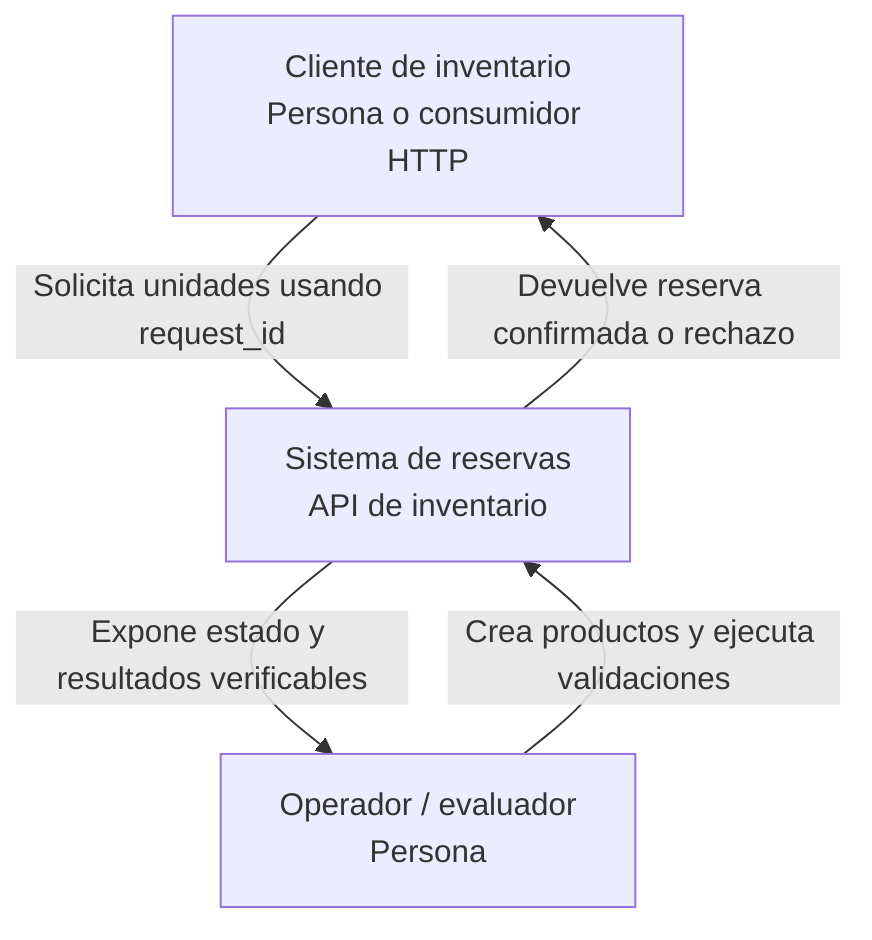
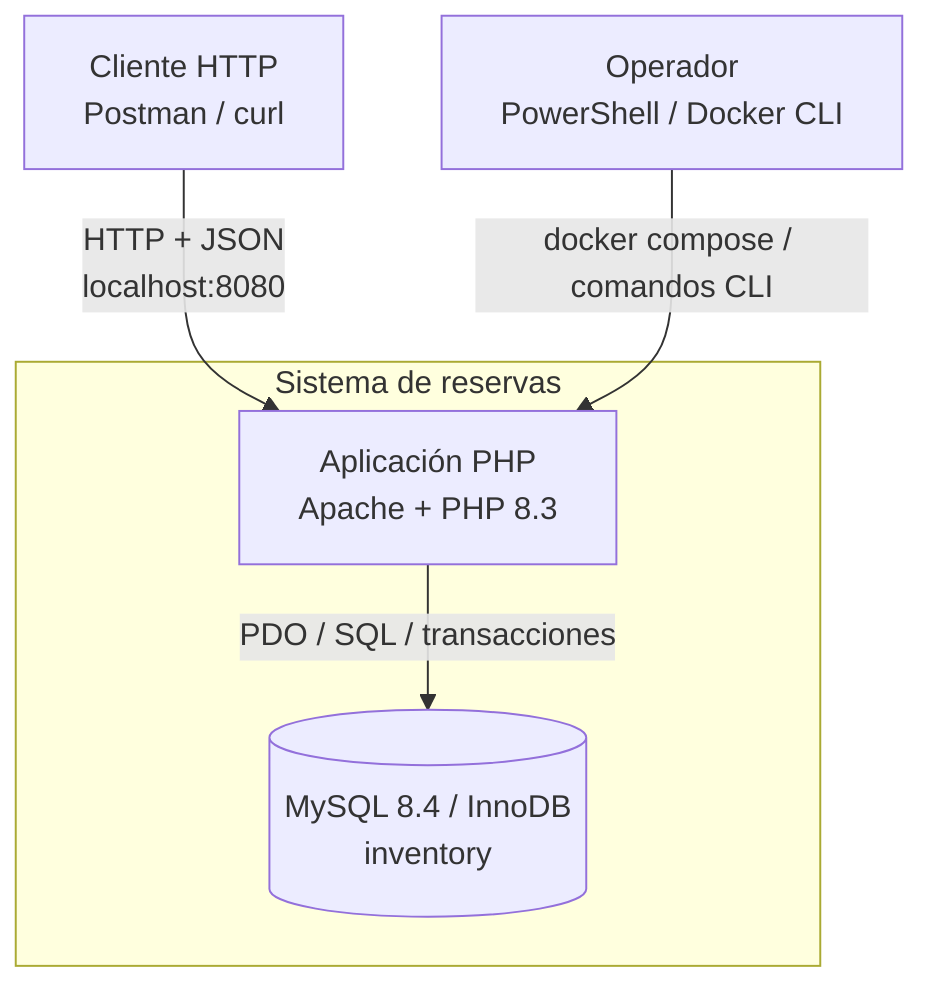
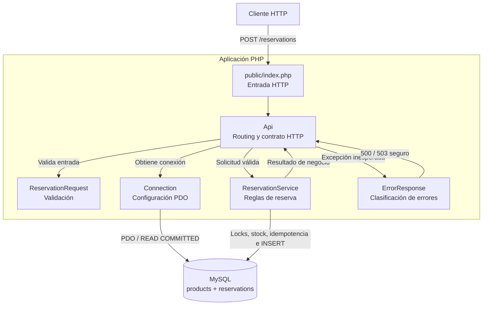
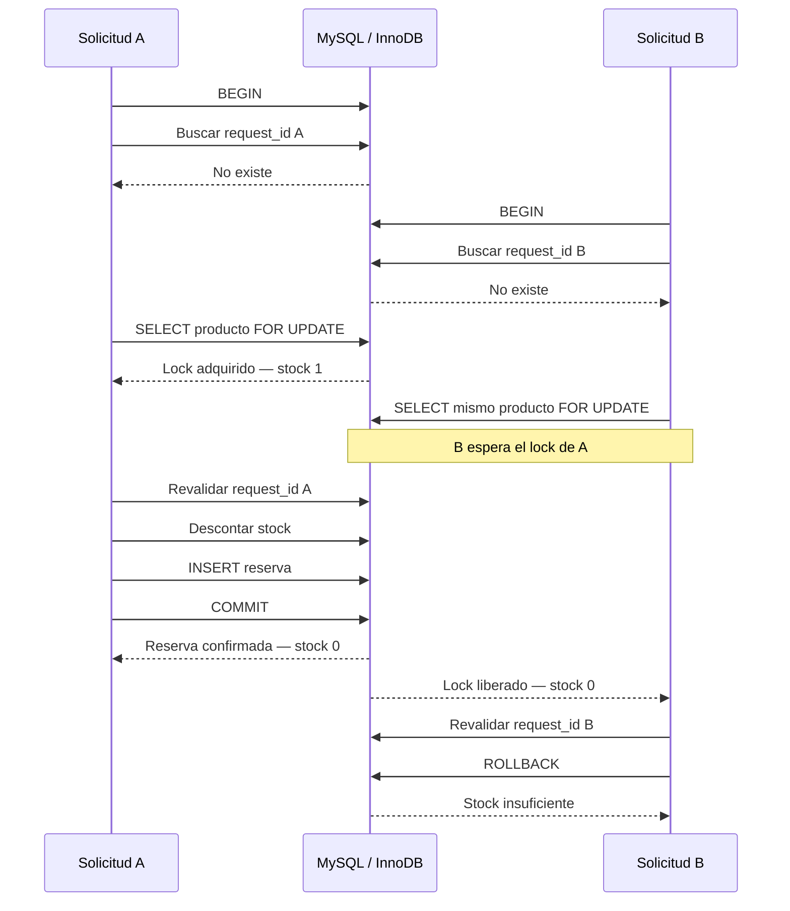

# API de reservas de inventario

API REST desarrollada en **PHP 8.3 + MySQL 8.4/InnoDB** para reservar inventario sin sobreventa y soportar reintentos idempotentes.

La solución fue validada en Windows con Docker mediante una suite de **38 pruebas y 154 aserciones**, incluyendo idempotencia, concurrencia real, colisión `1062` y recuperación ante deadlock `1213`.

Evidencia final:

- `evidence/windows-latest.txt`
- `evidence/windows-latest.xml`
- `reports/VALIDATION.md`

---

## 1. Ejecutar el proyecto

### Requisitos

- Windows 11
- Docker Desktop
- WSL 2
- Contenedores Linux habilitados

No es necesario instalar PHP, Composer, MySQL o XAMPP localmente.

Desde la raíz del proyecto:

```powershell
powershell -NoProfile -ExecutionPolicy Bypass -File .\bin\setup.ps1
docker compose up -d --build --wait
curl.exe -i http://localhost:8080/health
```

`bin/setup.ps1` genera localmente el archivo `.env`. Este archivo **no debe versionarse**.

El esquema se encuentra en:

```text
database/001_schema.sql
```

Contiene únicamente estructura, índices, restricciones y relaciones. Docker lo importa al inicializar un volumen nuevo.

### Crear un producto

```powershell
docker compose exec app php bin/create-product.php "Producto Demo" 10
```

Conserva el ID devuelto para realizar las reservas.

---

## 2. API

### Crear una reserva

```http
POST /reservations
Content-Type: application/json
```

Ejemplo:

```json
{
  "request_id": "REQ-2026-0001",
  "product_id": 1,
  "quantity": 3
}
```

Respuesta de una reserva nueva:

```json
{
  "reservation_id": 1,
  "status": "confirmed",
  "remaining_stock": 7
}
```

Comportamiento principal:

| Caso | Resultado |
| --- | --- |
| Reserva nueva válida | `201 Created` |
| Repetición de la misma solicitud | `200 OK`, misma reserva |
| Misma `request_id` con datos diferentes | `409 Conflict` |
| Stock insuficiente | `409 Conflict` |
| Producto inexistente | `404 Not Found` |
| Datos inválidos | `422 Unprocessable Entity` |
| JSON inválido | `400 Bad Request` |
| Error interno | `500 Internal Server Error` |
| Error temporal recuperable | `503 Service Unavailable` |

También puede importarse:

```text
postman/reservations.postman_collection.json
```

---

## 3. Arquitectura — modelo C4

Para esta API se documentan los niveles **C1, C2 y C3** del modelo C4.

No se añade un C4 de código porque el sistema contiene pocas clases y ese nivel repetiría información ya visible en C3 sin aportar claridad adicional.

### C1 — Contexto del sistema

Muestra quién utiliza el sistema y cuál es su responsabilidad principal.



El sistema tiene una responsabilidad acotada: administrar reservas de inventario garantizando stock no negativo, idempotencia y comportamiento consistente ante solicitudes concurrentes.

---

### C2 — Contenedores

Muestra las unidades ejecutables y el almacén de datos.



La aplicación PHP expone la API y contiene las reglas de negocio. MySQL mantiene productos, reservas, restricciones de integridad y mecanismos de bloqueo.

El entorno de pruebas utiliza servicios separados (`test-app`, `test-db` y `tests`) para no alterar los datos de la aplicación principal.

---

### C3 — Componentes de la aplicación

Muestra las responsabilidades principales dentro de PHP.



Responsabilidades principales:

- `Api`: contrato HTTP y coordinación.
- `ReservationRequest`: validación del cuerpo.
- `ReservationService`: transacciones, idempotencia y modificación de inventario.
- `Connection`: creación/configuración de PDO.
- `ErrorResponse`: separación de errores internos y temporales.

---

## 4. Secuencia crítica de concurrencia

El escenario más importante de la prueba es:

```text
Stock inicial = 1
Solicitud A = 1 unidad
Solicitud B = 1 unidad
```

El resultado obligatorio es una reserva confirmada, una rechazada y stock final `0`.



El acceso al producto queda serializado por `SELECT ... FOR UPDATE`. La segunda transacción observa el stock después del `COMMIT` de la primera y no puede llevarlo a un valor negativo.

---

## 5. Idempotencia y consistencia

`request_id` identifica de forma única una solicitud.

La idempotencia está protegida en dos niveles:

1. La aplicación busca una reserva existente y devuelve el resultado previamente confirmado.
2. MySQL aplica `UNIQUE(request_id)`, por lo que dos procesos no pueden confirmar dos reservas diferentes con la misma clave.

La restricción de base de datos es la garantía definitiva frente a una condición de carrera.

Si dos solicitudes con la misma clave compiten y una inserción pierde por `1062`, la transacción perdedora se revierte antes de recuperar la reserva ganadora. Así, cualquier descuento realizado dentro de esa transacción también queda revertido.

Las operaciones críticas de stock e inserción se ejecutan dentro de la misma transacción.

---

## 6. Pruebas

Ejecutar desde la raíz:

```powershell
powershell -NoProfile -ExecutionPolicy Bypass -File .\bin\test.ps1
```

La suite validada contiene:

| Tipo | Pruebas | Aserciones |
| --- | ---: | ---: |
| Unitarias | 24 | 78 |
| Integración | 14 | 76 |
| **Total** | **38** | **154** |

La cobertura funcional incluye, entre otros:

- reserva correcta;
- stock insuficiente;
- producto inexistente;
- cantidades inválidas;
- campos obligatorios;
- idempotencia;
- conflicto por reutilización incorrecta de `request_id`;
- dos solicitudes concurrentes sobre stock `1`;
- colisión real MySQL `1062`;
- deadlock real MySQL `1213` y reintento de la transacción.

Resultados de la última validación:

```text
evidence/windows-latest.txt
evidence/windows-latest.xml
```

La suite utiliza una base `inventory_test` independiente y servicios Docker específicos para pruebas.

---

## 7. Decisiones técnicas principales

### MySQL/InnoDB como autoridad del inventario

La protección contra sobreventa no depende únicamente de lógica en PHP. Se utilizan transacciones y bloqueos de fila en MySQL.

### Transacciones cortas

La transacción contiene únicamente las operaciones necesarias para comprobar y modificar el inventario y crear la reserva.

### `SELECT ... FOR UPDATE`

El producto se bloquea antes de decidir si existe stock suficiente. Las solicitudes concurrentes sobre el mismo producto se serializan.

### Idempotencia respaldada por `UNIQUE`

La validación en PHP mejora el flujo, pero `UNIQUE(request_id)` protege la integridad incluso ante carreras entre procesos.

### Reintentos limitados

Errores transitorios como `1205` y `1213` pueden reintentar la transacción completa hasta un límite definido. Los errores permanentes no se presentan como indisponibilidad temporal.

### Sin framework

El alcance de la prueba es pequeño. PHP + PDO permiten mostrar directamente las decisiones relevantes de concurrencia, transacciones e integridad sin introducir capas innecesarias.

### Docker

Se utiliza para reproducir el mismo entorno de PHP, MySQL y PHPUnit sin depender de instalaciones locales.

---

## 8. Seguridad

La entrega no debe contener:

- `.env`;
- contraseñas;
- tokens;
- API keys.

Se mantiene únicamente `.env.example` sin secretos.

PDO utiliza consultas preparadas y los errores HTTP no exponen credenciales, trazas ni mensajes internos de base de datos.

La solución es una demostración local y no implementa autenticación, ya que no forma parte del alcance solicitado.

---

## 9. Límites conocidos

- Las claves `request_id` se consideran globalmente únicas.
- Solo se almacenan reservas confirmadas.
- La solución no incluye frontend.
- Las imágenes Docker utilizan etiquetas de versión y no digests inmutables; esta mejora de reproducibilidad fue evaluada y no aplicada.
- No se implementa autenticación porque no fue requerida para el ejercicio.

---

## 10. Evidencia y trazabilidad

- `PROMPTS.md`: prompts utilizados, revisión crítica y decisiones sobre recomendaciones de IA.
- `evidence/windows-latest.txt`: salida legible de la última ejecución en Windows/Docker.
- `evidence/windows-latest.xml`: resultado JUnit de la última ejecución.
- `reports/VALIDATION.md`: resumen del alcance de validación.

El criterio de cierre de la solución no es que la IA indique que el código es correcto, sino que las invariantes principales puedan comprobarse mediante pruebas automatizadas, respuestas HTTP y estado persistido en MySQL.
